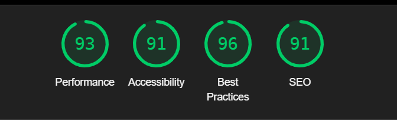

# Shopify Task - Video Content Platform 🎬

## 📖 Deployment Link
https://shopify-task-eta.vercel.app/

## 📌 Project Overview
This project is a **Shopify-based video content platform** that allows businesses and personal brands to **create, manage, and showcase short-form videos** at an affordable price. It features **a responsive design**, an interactive **carousel**, and an **FAQ section** to enhance user engagement.

## 🚀 Features
- **Responsive Design** – Adapts seamlessly to desktop, tablet, and mobile screens.
- **Navigation Bar with Dropdowns** – Users can access different sections easily.
- **Video Carousel** – Users can scroll through short-form video previews.
- **Interactive FAQ Section** – Expands answers when clicked.
- **Pricing Plans Section** – Showcases different subscription models.
- **Testimonials & Client Showcase** – Displays reviews from satisfied customers.

## 🎨 Technologies Used
- **HTML5** – Structure of the web page.
- **CSS3** – Styling and layout design.
- **JavaScript (Vanilla JS)** – Interactivity for the carousel and FAQ.
- **Responsive Design Techniques** – Ensures the UI adapts to various devices.

## 📖 How to Use
1. **Clone the Repository**:

   1. git clone https://github.com/asifbhuiyann/Shopify-Task.git

   2. cd shopify-task

## Chrome Dev Tool Lighthouse Performance
